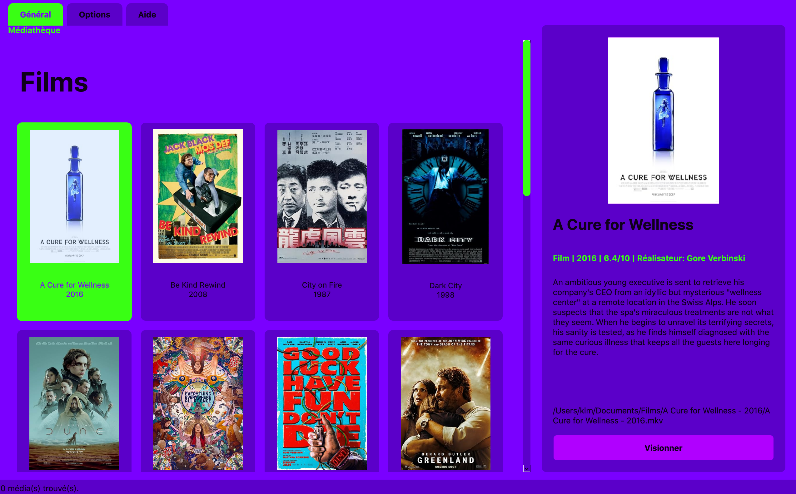
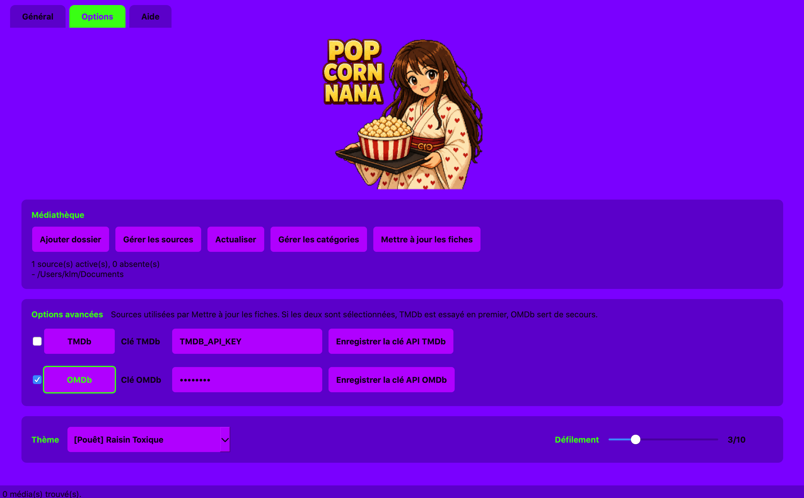

# Popcornana

Version actuelle: **1.0.71**

Popcornana est une application desktop locale pour organiser une médiathèque de films et séries. Elle scanne un dossier de vidéos, nettoie les noms de fichiers, affiche les médias dans une grille visuelle, récupère des métadonnées depuis OMDb et/ou TMDb, garde les affiches en cache local, puis lance la lecture avec VLC en plein écran quand il est disponible, avec sous-titre détecté automatiquement.

L'application conserve ses données localement: les vidéos restent dans le dossier choisi, la médiathèque est enregistrée dans une base SQLite et les affiches sont mises en cache sur la machine. Le dossier de stockage dépend du mode de lancement et du système (voir [Données locales](#données-locales)). Une connexion Internet est utilisée pour récupérer les métadonnées et les affiches depuis OMDb/TMDb.

## Aperçu






## Fonctionnalités

- Scan récursif d'un dossier de médias.
- Prise en charge des vidéos `.mkv`, `.mp4`, `.avi`, `.mov`.
- Détection des films et épisodes de séries avec les formats `S01E01`, `1x01`, `Season 01 Episode 01`, `Saison 01 Episode 01` et les dossiers `Saison 01/Episode 01`.
- Nettoyage automatique des noms de fichiers: qualité, codec, source, langue, tags de release.
- Affichage en grille avec affiche, titre et année.
- Regroupement des épisodes dans des dossiers de séries pour garder la médiathèque lisible.
- Regroupement des répertoires de films en dossiers navigables, avec visuel dédié possible.
- Séparation visuelle des sections `Films` et `Séries`.
- Panneau détail avec affiche, titre, durée, note, résumé, chemin du fichier et bouton `Visionner`.
- Zoom fiche au clic sur le panneau détail, avec texte agrandi, résumé scrollable et bouton `Visionner`.
- Résumés longs contenus dans des zones scrollables.
- Enrichissement automatique via OMDb.
- Recherches contextuelles TMDb/OMDb et édition manuelle des métadonnées depuis la grille.
- Création de `cover.*` et `Popinfo.txt` dans le dossier du film quand une fiche est enrichie sur une source autorisée, sans écraser les fichiers existants lors des enrichissements automatiques.
- Lecture automatique de `Popinfo.txt` et `cover.*` pendant `Actualiser`, pratique pour transporter une médiathèque entre plusieurs ordinateurs.
- Synchronisation des métadonnées entre sources avant les appels TMDb/OMDb quand un doublon local fiable possède déjà `cover.*` ou `Popinfo.txt`.
- Édition commune des métadonnées de série sans modifier les titres des épisodes.
- Choix persistant des sources de métadonnées dans `Options avancées`.
- Si OMDb et TMDb sont sélectionnés ensemble, TMDb est essayé en premier puis OMDb sert de secours.
- Cache local des affiches dans le sous-dossier `posters/` du dossier de données.
- Actualisation unique de la médiathèque: ajout des nouveaux fichiers et retrait des fichiers disparus.
- Sélecteur de thème et vitesse de défilement persistants.
- Lecture via VLC en plein écran si disponible, sinon lecteur par défaut du système.
- Détection automatique des sous-titres présents dans le même dossier que la vidéo.

## Interface

L'interface est divisée en trois onglets.

**Général**

Affiche la médiathèque sous forme de grille, séparée en sections `Films` et `Séries`. Les séries apparaissent comme des dossiers ouvrables, puis leurs épisodes sont listés à l'intérieur. Les dossiers de films apparaissent comme des dossiers navigables sans modifier les fiches des films contenus.

La sélection d'un média met à jour le panneau de droite avec les détails et le bouton `Visionner`. Un clic sur ce panneau ouvre le zoom fiche, plus lisible, avec résumé scrollable et bouton de lecture.

Un clic droit sur un film ou un épisode permet de lancer une recherche TMDb, une recherche OMDb ou une saisie manuelle du titre, de l'année, du réalisateur, du résumé et de l'affiche. Un clic droit sur une série permet d'appliquer une affiche, une année, un réalisateur et un résumé général aux épisodes sans changer leurs titres. Un clic droit sur un dossier de films permet de l'ouvrir, de choisir son visuel propre ou de modifier sa description (résumé, biographie, etc.).

Sur les sources autorisées, la description du dossier est enregistrée dans le champ `folder_description` de son `Popinfo.txt`, avec les retours à la ligne encodés en JSON, sans modifier le `synopsis` des vidéos. Son visuel est enregistré dans `repocover.jpg`, `.jpeg`, `.png` ou `.webp`, séparément du `cover.*` du film. Ces informations sont relues à l'actualisation et au démarrage pour les dossiers classés « Dossier de films ». Les anciens visuels conservés en cache restent utilisables ; choisir à nouveau un visuel crée sa copie portable si la synchronisation est autorisée. Sinon, les modifications restent locales à Popcornana.

**Options**

Regroupe les actions et réglages:

- `Ajouter dossier`: ajoute une source à la médiathèque sans remplacer les autres.
- `Gérer les sources`: affiche les sources connues, permet de retirer celles qui ne doivent plus être suivies et d'autoriser la synchronisation locale.
- `Actualiser`: analyse les sources disponibles, ajoute les vidéos détectées, lit les fiches portables `Popinfo.txt`/`cover.*` présentes dans les dossiers et retire les entrées dont le fichier n'existe plus dans ces sources.
- `Mettre à jour les fiches`: récupère les métadonnées avec les sources sélectionnées et affiche une fenêtre de progression.
- `Gérer les catégories`: force un dossier en Auto, Film unique, Dossier de films, Série, Dossier de séries ou Ignorer.
- `Options avancées`: permet de choisir OMDb, TMDb ou les deux et d'enregistrer les clés API.
- `Thème`: change le thème visuel de l'application et ajuste la vitesse de défilement.

**Aide**

Décrit le fonctionnement de Popcornana, donne les adresses pour obtenir les clés API TMDb/OMDb et résume les choix techniques dans une section `Pour les Geeks`.

## Métadonnées

Avant d'appeler Internet, `Mettre à jour les fiches` cherche d'abord un doublon local fiable dans les autres sources. Si un dossier équivalent possède déjà `cover.*` ou `Popinfo.txt`, Popcornana copie uniquement les fichiers manquants vers la source cible lorsque sa case `Synchro autorisée` est cochée.

Valider une nouvelle autorisation dans `Gérer les sources` exporte immédiatement les fiches déjà connues vers cette source, en créant les fichiers manquants. Les fichiers existants sont préservés. Une édition manuelle met ensuite à jour la fiche portable et remplace l’affiche uniquement si elle a été changée ; la description propre au dossier est conservée. Sans autorisation de synchronisation, même les éditions manuelles restent locales à Popcornana.

Les remplacements sont préparés dans un fichier temporaire, puis appliqués avec conservation de la version précédente dans un fichier `.bak`. Dans un dossier contenant plusieurs vidéos, un `Popinfo.txt` identifié comme appartenant à une autre vidéo est préservé.

L'autorisation est mémorisée dans `.popcornana-source` à la racine de la source. Ce fichier limite l'écriture aux fichiers de métadonnées portables et conserve la version du format utilisé.

Les clés API peuvent être enregistrées depuis `Options avancées`. Elles peuvent aussi être placées dans le fichier `.env`.

```env
TMDB_API_KEY=xxxxxxxx
OMDB_API_KEY=xxxxxxxx
```

Les valeurs placeholder comme `xxxxxxxx` sont ignorées par l'application et ne sont pas considérées comme des clés valides.

Adresses utiles:

- TMDb: <https://www.themoviedb.org/settings/api>
- OMDb: <https://www.omdbapi.com/apikey.aspx>

## Sous-titres

Quand VLC est disponible, Popcornana cherche automatiquement un sous-titre dans le même dossier que la vidéo.

Règle de sélection:

1. priorité au fichier de sous-titre portant exactement le même nom que la vidéo ;
2. sinon, utilisation du premier fichier de sous-titre trouvé dans le dossier.

Extensions reconnues:

```text
.srt
.ass
.ssa
.sub
.vtt
```

Exemples:

```text
Film.mkv
Film.srt
```

ou:

```text
Film.mkv
sous_titre_francais.srt
```

## Installation

Depuis la racine du projet:

```bash
python3.12 -m venv .venv
source .venv/bin/activate
pip install -r requirements.txt
cp .env.example .env
```

Puis renseigner les clés API dans `.env`.

## Lancement

```bash
.venv/bin/python main.py
```

Ou, si l'environnement virtuel est activé:

```bash
python main.py
```

## Données locales

Depuis les sources, les données sont stockées dans `data/` à la racine du projet. Les versions distribuées utilisent les emplacements suivants:

| Système | Dossier de données |
| --- | --- |
| Windows | `%APPDATA%\Popcornana` |
| macOS | `~/Library/Application Support/Popcornana` |
| Linux | `$XDG_DATA_HOME/Popcornana`, ou `~/.local/share/Popcornana` si cette variable n'est pas définie |

Ce dossier contient:

```text
media.db        base SQLite locale
posters/        cache local des affiches
cache/          dossier réservé aux caches futurs
```

Pour un lancement depuis les sources, le fichier `.env` peut contenir les clés API à la racine du projet; il est ignoré par git.

## Structure du projet

```text
app/
  database/   accès SQLite et réglages persistants
  models/     modèles de données
  omdb/       client OMDb
  scanner/    scan vidéo et parsing de noms
  tmdb/       client TMDb
  ui/         interface PySide6
  utils/      chemins, lecture média, helpers
assets/        logo et images de l'application
data/          cache local créé/utilisé par l'application
main.py        point d'entrée
VERSION        version applicative
CHANGELOG.md   historique des versions
```

## Build multi-OS

Le projet dispose d'un workflow GitHub Actions pour générer des releases distinctes par OS.

Artefacts produits:

- `Popcornana-<version>-macos-<nom-os>-intel.zip`: application `.app` macOS Intel ;
- `Popcornana-<version>-macos-<nom-os>-intel.dmg`: image disque macOS Intel ;
- `Popcornana-<version>-windows-x64.zip`: exécutable Windows x64 ;
- `Popcornana-<version>-linux-x64.tar.gz`: exécutable Linux x64 ;
- `Popcornana-<version>-linux-x64.AppImage`: application Linux x64 portable.

Chaque artefact est accompagné d'un fichier `.sha256` permettant de vérifier son intégrité.

Le workflow est défini dans `.github/workflows/release.yml`. Il peut être lancé manuellement depuis l'onglet Actions de GitHub, ou automatiquement lors d'un push sur `main` ou d'un tag `v*`. Chacun de ces lancements construit les artefacts puis publie une release GitHub. Pour pousser sur `main` sans lancer ce workflow, inclure `[skip ci]` dans le message du commit.

Exemple de release:

```bash
git tag v1.0.71 main
git push origin main
git push origin v1.0.71
```

GitHub Actions construit les artefacts des trois systèmes et les ajoute à la release GitHub correspondant au fichier `VERSION`.

Pour construire localement sur l'OS courant:

```bash
python -m pip install -r requirements.txt -r requirements-build.txt
python scripts/build_release.py --target macos-intel
python scripts/build_release.py --target windows-x64
python scripts/build_release.py --target linux-x64
```

Seule la cible correspondant au système courant est réellement prévue pour un build local fiable. Le build multi-OS complet passe par GitHub Actions.

macOS:

```bash
python scripts/build_release.py --target macos-intel
```

Le build macOS produit `dist/Popcornana.app`, une archive `.zip`, une image disque `.dmg` et leurs fichiers `.sha256`. Les fichiers macOS incluent automatiquement le nom de l'OS utilisé pour construire l'app, par exemple `macos-sonoma-intel` ou `macos-catalina-intel`.

Pour vérifier un artefact:

```bash
cd dist
shasum -a 256 -c Popcornana-<version>-macos-<nom-os>-intel.dmg.sha256
```

Windows:

```bash
python scripts/build_release.py --target windows-x64
```

Linux:

```bash
python scripts/build_release.py --target linux-x64
```

La cible Linux nécessite `appimagetool` dans le `PATH` pour générer l'artefact `.AppImage`.

Avant de compiler sur Ubuntu/Debian, installer les bibliothèques Qt natives (le venv Python ne les fournit pas) :

```bash
sudo apt install libegl1 libgl1 libx11-xcb1 libxkbcommon-x11-0 libxcb1 libxcb-cursor0 libxcb-icccm4 libxcb-image0 libxcb-keysyms1 libxcb-randr0 libxcb-render-util0 libxcb-shape0 libxcb-shm0 libxcb-sync1 libxcb-xfixes0 libxcb-xkb1 libxcb-glx0 libxcb-util1 libwayland-client0 libwayland-cursor0 libwayland-egl1
```

Le build analyse avec `ldd` les plugins XCB et Wayland de PySide6, ainsi que leurs intégrations graphiques. Une dépendance introuvable bloque la compilation. Les bibliothèques clientes X11, XCB (dont `libxcb-cursor.so.0`), xkbcommon et Wayland sont ajoutées explicitement au paquet PyInstaller. Le paquet monofichier est ensuite inspecté et ses bibliothèques extraites dans `build/qt-dependency-audit/` ; `dependency-report.txt` indique les chemins réellement résolus. Le build échoue si un plugin dépend encore d’une bibliothèque cliente X11/XCB/Wayland du système plutôt que de sa copie embarquée.

L’AppDir contient cet exécutable monofichier : les bibliothèques Qt sont dans son archive interne, et non directement dans `usr/lib`. `appimagetool` encapsule l’AppDir ; il ne recherche pas les dépendances. Aucun lanceur ne force `QT_QPA_PLATFORM` : Qt choisit le backend de la session.

Sur la machine de destination, `libxcb-cursor0` ne doit plus être nécessaire séparément pour les nouveaux builds validés. Restent requis un serveur X11 ou un compositeur Wayland, les pilotes graphiques adaptés et la pile OpenGL/EGL du système (`libgl1`, `libegl1` sur Ubuntu/Debian). La glibc (`libc6`) et son chargeur ne sont pas embarqués : ils doivent être compatibles avec la machine de compilation. Une compilation sur une distribution récente ne garantit donc pas le fonctionnement sur une distribution plus ancienne. Construire sur la plus ancienne distribution cible prise en charge par la version de PySide6 utilisée.

Le lancement habituel de cette AppImage de type 2 nécessite FUSE 2 (`libfuse2` ou `libfuse2t64` selon la version d’Ubuntu). Sans FUSE, utiliser `APPIMAGE_EXTRACT_AND_RUN=1 ./Popcornana-<version>-linux-x64.AppImage`.

Validation graphique recommandée : lancer l’AppImage dans une session X11 puis Wayland, avec `QT_QPA_PLATFORM` non défini. Un test `offscreen` seul ne valide pas X11/Wayland. Pour diagnostiquer, `QT_DEBUG_PLUGINS=1` affiche les plugins chargés. Tester également dans une VM minimale sans `libxcb-cursor0` installé ; le poste de compilation, où ces paquets sont présents, ne suffit pas à prouver toute la portabilité.

Références : [dépendances Qt sous Linux](https://doc.qt.io/qt-6/linux-requirements.html), [limitations GNU/Linux de PyInstaller](https://pyinstaller.org/en/stable/usage.html#making-gnu-linux-apps-forward-compatible).


## Version

La version actuelle est `1.0.71`.

Voir [CHANGELOG.md](CHANGELOG.md) pour le détail de l'état de la release.
